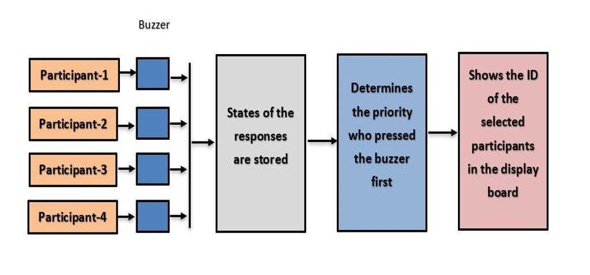
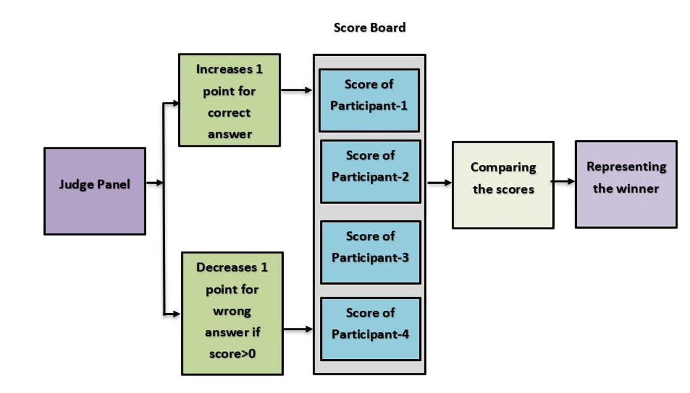
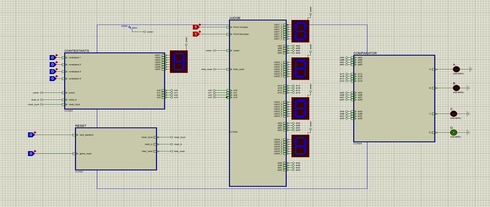

# Four Player Based Quiz System  

Youtube Link for demonstration: https://www.youtube.com/watch?v=NQd-jBvdyVU

Features:  
<ul>
  <li> In our project, there are four participants </li> 
  <li> Inputs are taken by buzzer </li>
  <li> Point reduction for wrong answer is available </li> 
  <li> Winner/s is/are shown by LED </li>  
  </ul>
 

  

  
  
